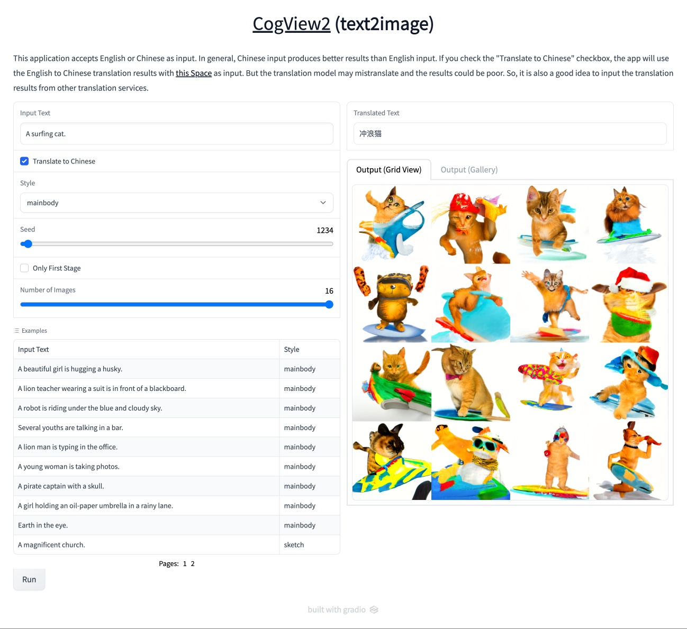

# CogView2 demo
This is an unofficial demo app for [CogView2](https://github.com/THUDM/CogView2).



## Prerequisite
You need to use an A100 GPU instance to run CogView2.

## Installation
### Preparation
First, put `"default-runtime": "nvidia"` in `/etc/docker/daemon.json`.
See: https://github.com/NVIDIA/nvidia-docker/issues/1033#issuecomment-519946473
```json
{
    "runtimes": {
        "nvidia": {
            "path": "/usr/bin/nvidia-container-runtime",
            "runtimeArgs": []
        }
    },
    "default-runtime": "nvidia"
}
```

Then, restart docker.
```bash
sudo systemctl restart docker
```

### Build docker image
```bash
docker build . -t cogview2
```

### Apply patch to CogView2 repo
```bash
cd CogView2
patch -p1 < ../patch
```

## Run
```bash
docker compose run --rm cogview2 python app.py
```
